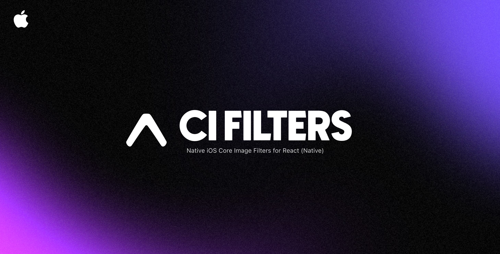

<div align="center">
  
</div>

<h1 align="center">expo-ios-ci-filters</h1>

<p align="center">
  Native iOS Core Image Filters exposed to React Native via Expo.
</p>

<div align="center">
  <p>
    
    
    
    
  </p>

  <p>
    
  </p>
</div>

## ✨ Features

- 🖼 **Bridge to iOS Core Image** — Use Apple’s **native Core Image filters** directly in React Native via a simple component API.
- 🔄 **Multiple filters at once** — Chain multiple filters (e.g., `motionBlur` + `colorControls` + `vignette`) in a single render pass.
- ⚡ **Real-time performance** — Filters are applied using native iOS rendering for **smooth, GPU-accelerated updates**.
- 🎨 **Color & tone controls** — Adjust `brightness`, `contrast`, `saturation`, `exposure`, `vibrance`, `gamma`, `hue`.
- 🌀 **Advanced blur effects** — Motion blur, Gaussian blur, masked variable blur (with per-point control).
- 🖌 **Sharpen & vignette** — Enhance edges or apply cinematic vignette styling.
- 🌈 **Gradient overlay** — Add multi-stop gradients with configurable positions, RGBA values, and Core Image blend modes.
- 🔍 **Full parameter control** — Configure filter parameters with **fine-grained TypeScript typings**:
  - Normalized coordinates (`point0X`, `point0Y`, etc.)
  - Radians for angles
  - Blend modes (`screen`, `multiply`, etc.)

- 📏 **Safe border radius** — Native `borderRadius` support for rounded-corner images.
- 🧩 **Simple props interface** — Pass props directly to `<CIFilterView />`, no need to learn Core Image API syntax.
- 📱 **Expo & React Native support** — Works seamlessly in Expo SDK 53+ projects without ejecting.
- 🔮 **Future-proof** — Easy to extend with new Core Image filters as they’re added in iOS updates.

---

## 📦 Installation

```sh
pnpm install expo-ios-ci-filters
```

Then install pods:

```sh
cd ios && pod install
```

> **Note:** This library is **iOS-only** (Core Image is iOS-specific).
> Requires **Expo SDK 53+**.

---

## 🚀 Usage

```tsx
import React from "react";
import { View, StyleSheet } from "react-native";
import { CIFilterImage } from "expo-ios-ci-filters";

export default function App() {
  return (
    <View style={styles.container}>
      <CIFilterImage
        url="https://images.pexels.com/photos/1042423/pexels-photo-1042423.jpeg"
        motionBlur={{
          angle: 0,
          radius: 20,
        }}
        style={styles.image}
      />
    </View>
  );
}

const styles = StyleSheet.create({
  container: {
    flex: 1,
    justifyContent: "center",
    alignItems: "center",
  },
  image: {
    width: 300,
    height: 300,
  },
});
```

---

## 🛠 Supported Filters

| Filter               | Config Interface           | Properties                                                       |
| -------------------- | -------------------------- | ---------------------------------------------------------------- |
| Motion Blur          | `MotionBlurConfig`         | `radius`, `angle`                                                |
| Gaussian Blur        | `GaussianBlurConfig`       | `radius`                                                         |
| Masked Variable Blur | `MaskedVariableBlurConfig` | `radius`, `point0X/Y`, `point1X/Y`, `color0Alpha`, `color1Alpha` |
| Color Controls       | `ColorControlsConfig`      | `brightness`, `contrast`, `saturation`                           |
| Exposure             | `ExposureConfig`           | `ev`                                                             |
| Vibrance             | `VibranceConfig`           | `amount`                                                         |
| Gamma Adjust         | `GammaConfig`              | `power`                                                          |
| Hue Adjust           | `HueAdjustConfig`          | `angle`                                                          |
| Sharpen              | `SharpenConfig`            | `sharpness`                                                      |
| Vignette             | `VignetteConfig`           | `intensity`, `radius`                                            |
| Gradient Overlay     | `GradientOverlayConfig`    | Position, colors, `blendMode`                                    |

---

## 📜 License

MIT © [rit3zh](https://github.com/rit3zh)
Built with ❤️ using **Expo** and **Core Image**.
